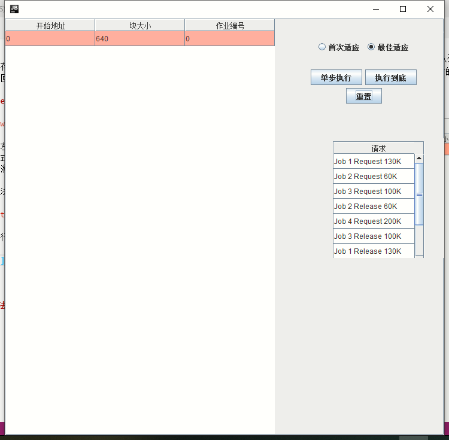
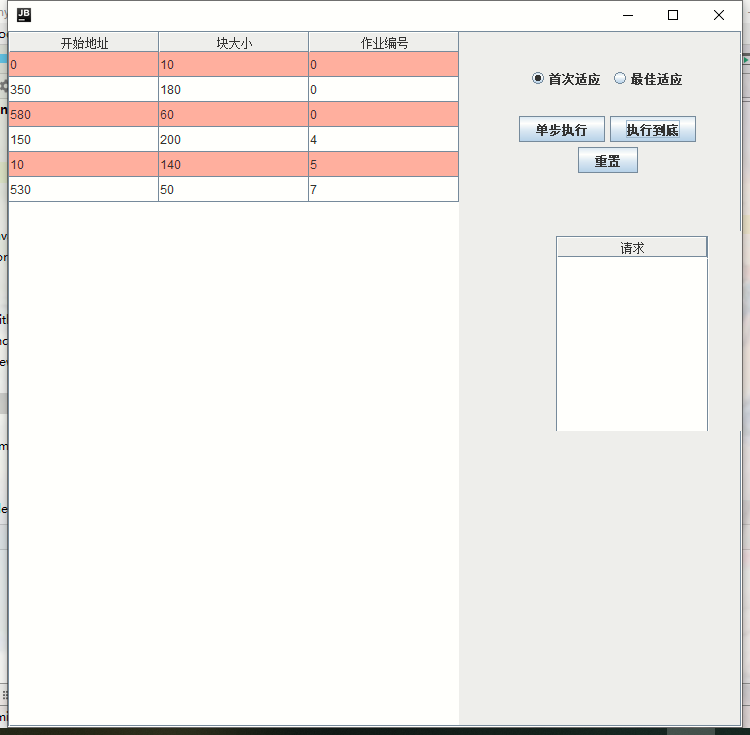
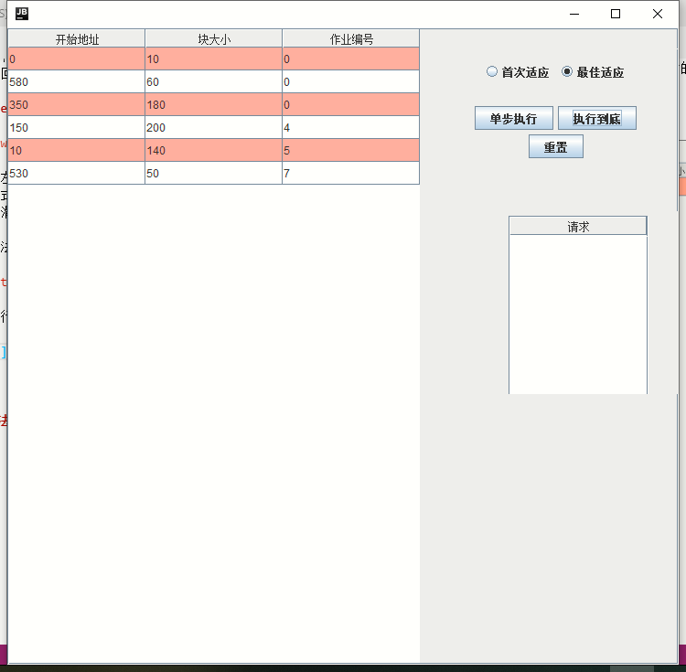
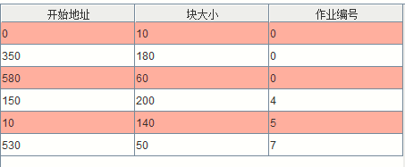
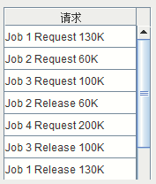

# Allocator Simulator(动态分区分配方式)

>施程航 1651162

## 需求

给定可用内存空间640K和请求队列，分别用首次适应算法和最佳适应算法进行内存块的分配和回收，并显示出每次分配和回收后的空闲分区链的情况。

## Overview



如图所示，左侧为空闲链表的显示。右上方为选择面板，用户可以自行选择适应算法和执行模式。右下方为当前未执行的申请(Request)或释放(Release)内存的请求，可上下滑动滑条查看所有请求。

首次适应算法执行结果：



最佳适应执行结果：  



## 模块设计

### 内存块(Block)

Block: 用于模拟一块内存，一个Block存储的信息有起始地址、大小以及当前占用该内存块的作业编号。

```java
public class Block {
    int startAddr;//内存块开始地址
    int blockSize;//内存块大小,KB为单位
    int jobIndex = 0; //占用该内存块的作业编号，0 表示无人占用

    ...
    ...

}
```

在模拟动态分配内存时，我们有时需要对内存块进行分割或者合并。

```java
//分割内存块，第一部分是剩下来的，第二部分是分配出去的
    public static Block[] splitBlock(@NotNull Block ori, int requiredSize){
        //一个分割的Block应该是无人占用的
        assert ori.jobIndex == 0 && ori.blockSize > requiredSize;
        ori.blockSize -= requiredSize;

        Block newBlock = new Block(ori.startAddr + ori.blockSize, requiredSize);

        Block[] result = {ori, newBlock};

        return result;
    }

    //合并内存块，将第二块内存合并到第一块内存的后面
     public static Block mergeBlock(@NotNull Block fir, @NotNull Block sec){
        assert fir.startAddr+fir.blockSize == sec.startAddr;
        fir.blockSize += sec.blockSize;

        return fir;
     }
```

### 分配器(Allocator)

在`Allocator.java`里实现了分配器的逻辑。

fitAlgorithm: 适应算法的接口。  
fitInstance: 适应算法的基类。  
bestFit: 最佳适应算法的具体实现。  
firstFit: 最先适应算法的具体实现。  

这里我们使用了策略模式，其中fitAlgorithm声明了一个适应算法需要支持的接口：

```java
// 适应算法的接口
interface fitAlgorithm{
   public Block malloc(int jobIndex, int requiredSize);
   public void free(int jobIndex, int blockSize);
   public List<Block> getEmptyList();
    public List<Block> getBusyList();
}
```

具体算法实现由`bestFit`和`firstFit`完成。采用策略模式的优点是算法独立于`Allocator`，在后面我们可以很轻易地实现并且加入其他的适应算法而不用对`Allocator`的实现进行修改。

```java
public class Allocator {
    fitAlgorithm algorithm;//适应算法

    ...
    ...
}
```

### 图形界面(AllocatorView)

在`AllocatorView.java`我们实现了图形化界面。

具体类(class)概览：  
AllocatorView: 主界面，作为其他组件的容器，放置按钮、单选框和表格等。  
BaseTable: MTable和RequestTable的父类。  
MTable: 显示内存块的情况。在此我们优先显示**空闲链表**，而后是**已分配的链表**，我们规定合法的作业编号均为正整数，其中作业编号为0表示该内存块无人占用，作业编号为正整数m代表该内存块被作业m占用。  



RequestTable: 显示当前所有的请求，包括一个指定作业请求(Request)或释放(Release)指定大小的内存块。



**按钮监听器**：  

我们分别给三个按钮加入了以下监听器：

```java
//启动按钮和重置
        JButton[] buttons = {
                new JButton("单步执行"),
                new JButton("执行到底"),
                new JButton("重置"),
        };

    ...
    ...

```

重置所有设置：

```java
//Reset
    void resetAll(){
        //重置分配器
        allocator = new Allocator(algorithm == 0? (new firstFit()):(new bestFit()));
        //重置显示内存块的Table
        table.updateBlocks(allocator.algorithm.getEmptyList(),allocator.algorithm.getBusyList());
        // 重置作业请求Table
        requestTable.setRequests(Allocator.getRequests());
    }
```

单步执行：

```java
//Single Step
    void singleStep(){
        String request = requestTable.removeOneRow();
        if(request == ""){
            System.out.println("Empty Request!");
            return;
        }

        //分割字符串，转化为具体的请求
        String[] result = request.substring(4, request.length() - 1).split(" ", 4);
        System.out.println(result[0]+" "+result[1]+" "+result[2]);
        int jobIndex = Integer.parseInt(result[0]);
        int blockSize = Integer.parseInt(result[2]);
        if(result[1].equals("Release")){
            allocator.free(jobIndex, blockSize);
        }else if(result[1].equals("Request")){
            allocator.malloc(jobIndex, blockSize);
        }else {
            assert false;
        }

        //更新表格信息
        table.updateBlocks(allocator.algorithm.getEmptyList(),allocator.algorithm.getBusyList());
    }
```

执行到底：

```java
//Run till the end
    void runAll(){
        while (requestTable.hasRequest()){
            singleStep();
        }
    }
```

## 适应算法实现

### 适应算法的抽象类

我们引入fitInstance作为抽象类来实现最佳适应算法和最先适应算法的公共逻辑。其中`emptyList`为空闲链表，`busyList`为已分配链表。

```java
//适应算法的抽象基类，用于实现公共逻辑
abstract class fitInstance implements fitAlgorithm{
    // 空闲链表
    protected List<Block> emptyList = new LinkedList<Block>();

    //已分配链表
    protected List<Block> busyList = new LinkedList<Block>();

    @Override
    public List<Block> getEmptyList(){
        return emptyList;
    }
    @Override
    public List<Block> getBusyList(){
        return busyList;
    }

    //这里的查找其实是不太精确的，考虑到一个作业有可能申请多个相同大小的内存块
    //而不给出地址的话在我们看来这两个内存块应该是等价的，故此我们在此直接返回第一个符合大小和作业编号的内存块

    //注意到其实两个算法在找一个特定的即将要释放的块时是相同的，所以直接在基类实现
    protected Block findBlockInBusyList(int jobIndex, int blockSize){
        Iterator<Block> it = busyList.iterator();
        Block ret = null;

        while (it.hasNext()){
            Block block = it.next();
            if(block.blockSize == blockSize && block.jobIndex == jobIndex){
                it.remove();//移除指定内存块
                ret = block;
            }
        }

        if(ret == null){
            //找不到指定的内存块
            System.out.println("No such Block with size " + blockSize + "and jobIndex " + jobIndex +"!");
        }
        return ret;
    }
}
```

### 最先适应算法(firstFit)

**初始化**。注意到我们在放入640K的初始内存块前放入了一个起始地址为-1，大小为0的内存块作为**哨兵节点**，这主要是为了方便在释放内存块也就是**在空闲链表(emptyList)中加入内存块**时的处理，避免了emptyList为空时需要特殊处理。

```java
public firstFit(){
        //在头部加入哨兵节点，设置大小为0，这样就不会被分配出去
        //一个注意的点是bestFit插入方法不同于firstFit（取决于emptyList的排列基准），故bestFit不需要哨兵节点
        //在显示时需要做下判断
        emptyList.add(new Block(-1, 0));
        emptyList.add(new Block(0, 640));
    }
```

在最先适应算法中，空闲块在emptyList中是按照**地址从大到小**排列的。

**内存分配**。分配内存时我们遍历emptyList：

- 找到第一个大小足够大的块。
  - 如果该内存块的大小刚好等于需要的规格，那么整块分配出去，把其加入busyList。
  - 如果该块大小大于所需，则分割内存块，把大小合适的后部分分割出去，留下前部分继续留在emptyList中。
- 如果没有足够的内存，我们报错并且返回`null`表示分配失败。

```java
@Override
    public Block malloc(int jobIndex, int requiredSize){
        //找出足够大的第一块，分割后留下前部
        //注意到这里我们是按地址排序，分割后若有剩余不用调整emptyList
        //如果刚好分配一整块出去，那么我们直接从emptyList把这个块删除
        Iterator<Block> it = emptyList.iterator();
        while (it.hasNext()){
            Block block = it.next();
            if(block.blockSize < requiredSize)continue;
            //
            if(block.blockSize == requiredSize){
                it.remove();

                makeBusy(block, jobIndex);
                return block;
            }else{
                assert block.blockSize > requiredSize;
                Block[] result = Block.splitBlock(block, requiredSize);

                makeBusy(result[1], jobIndex);
                return result[1];
            }
        }

        System.out.println("No Enough Memory for First Fit!");
        return null;
    }
```

**内存释放**。释放一个内存块时我们需要有以下步骤：

- 首先在busyList中寻找到该内存块并且把它移除。
- 在emptyList中找到该内存块应该插入的位置。由于地址由低到高排序，故我们只需要找到第一块起始地址比该内存块起始地址大的内存块，其前面就是插入位置。
- 内存块的合并。插入前我们需要判断该内存块能否与前后两个内存块合并，如果可合并则合并后再进行插入。注意这里如果存在可合并的内存块，需要将该内存块从emptyList中移出来。另外如果插入位置前的内存块可合并的话我们需要调整插入位置(insertIndex)。

```java
@Override
    public void free(int jobIndex, int blockSize){
        //先在busyList中找出要释放的内存块，这点和bestFit算法类似
        Block insertedBlock = super.findBlockInBusyList(jobIndex, blockSize);
        assert insertedBlock != null;

        //将找到的释放块重新放入emptyList中
        //注意到这里放入的时候是按照地址排序
        //找到该内存块应该放入的位置后，确定两个内存块是否能合并只要判断插入位置前后两个内存块的地址即可

        int insertIndex = 1;//插入位置

        Iterator<Block> it = emptyList.iterator();
        Block prev = it.next(), next = null; // 插入位置的前驱和后继

        while (it.hasNext()){
            next = it.next();

            if(next.startAddr>insertedBlock.startAddr){
                break;
            }
            insertIndex ++;//注意因为存在哨兵节点，被释放的block至少放在第二个位置上
            prev = next;
        }

        if(prev.startAddr + prev.blockSize == insertedBlock.startAddr){
            insertedBlock = Block.mergeBlock(prev, insertedBlock);
            emptyList.remove(prev);
            insertIndex--;
        }
        if(next != null && insertedBlock.startAddr + insertedBlock.blockSize == next.startAddr){
            insertedBlock = Block.mergeBlock(insertedBlock, next);
            emptyList.remove(next);
        }

        insertedBlock.jobIndex = 0;//消除作业编号
        emptyList.add(insertIndex, insertedBlock);
    }
```

### 最佳适应算法(bestFit)

**初始化**。在空闲链表中加入起始地址为0，大小为640K的初始内存块。

```java
public bestFit(){
        emptyList.add(new Block(0, 640));
    }
```

在最佳适应算法中我们的内存块是按照**内存块的大小**进行排序的，这样我们遍历emptyList时第一块大于符合规格的内存块便是最佳适应块。

**内存分配**。分配一块内存我们需要执行以下步骤：

- 遍历emptyList，找到第一块内存大小大于等于所需规格的内存块。
- 将该内存块移出emptyList。如果该内存大小刚好等于所需规格，算法结束。
- 若内存大小大于所需规格，则把大小合适的后半部分内存分配出去，剩下前半部分内存。我们需要重新遍历emptyList将该剩下的内存块**重新放入emptyList**。重新放入emptyList的逻辑和释放一块内存块的逻辑是类似的，故此我们实现了一个公共的内部函数`void free(Block insertedBlock)`，在后面的内存释放板块我们再对其进行解析。

```java
@Override
    public Block malloc(int jobIndex, int requiredSize){
        Iterator<Block> iterator = emptyList.iterator();
        while (iterator.hasNext()){
            Block block = iterator.next();
            if(block.blockSize > requiredSize){
                iterator.remove();

                Block[] results = Block.splitBlock(block, requiredSize);
                results[1].jobIndex = jobIndex;

                malloc(results[1]);//把后部加入占用链表
                free(results[0]);//把前部重新加入空闲链表

                return results[1];
            }else if (block.blockSize == requiredSize){
                iterator.remove();
                block.jobIndex = jobIndex;
                malloc(block);
                return block;
            }
        }

        System.out.println("No enough Memory!");
        return null;
    }
```

**内存释放**。释放一块内存我们需要执行以下步骤：

- 从busyList中找出该内存块。
- 将该内存块放入emptyList。

```java
@Override
    //找出要释放的内存块，放入emptyList中
    public void free(int jobIndex, int blockSize){
        Block block = super.findBlockInBusyList(jobIndex, blockSize);
        free(block);
    }
```

把一块内存插入emptyList中的具体逻辑是由`free(Block insertedBlock)`实现的。这里插入的内存块可能是分割后剩下的内存块，也可能是用户释放的内存块。对内存块的释放，我们需要执行以下步骤：

- 遍历emptyList，寻找是否存在能与插入块合并的内存块。
- 把可合并的内存块从emptyList中删除。
- 如果存在可合并的块，插入块变为合并后的大内存块。
- 重新遍历emptyList，找到合适的插入位置。


```java
//这里的block可能是分割后产生的，也可能是某个Job free的
    private void  free(Block insertedBlock){
        Block prev = null, next = null;
        Iterator<Block> it = emptyList.iterator();

        //找到可能存在的可合并内存块
        while (it.hasNext()){
            Block block = it.next();
            if(block.startAddr + block.blockSize == insertedBlock.startAddr){
                prev = block;
                it.remove();
            }else if(block.startAddr == insertedBlock.startAddr + insertedBlock.blockSize){
                next = block;
                it.remove();
            }
        }

        //合并内存块
        if(prev != null){
            insertedBlock = Block.mergeBlock(prev, insertedBlock);
        }
        if(next != null){
            insertedBlock = Block.mergeBlock(insertedBlock, next);
        }
        insertedBlock.jobIndex = 0;//消除作业编号的标记

        //重新插入空闲链表
        int insertIndex = 0;
        it = emptyList.iterator();
        while (it.hasNext()){
            Block block = it.next();
            if(block.blockSize >= insertedBlock.blockSize){
                break;
            }
            insertIndex++;
        }

        emptyList.add(insertIndex, insertedBlock);
    }
```